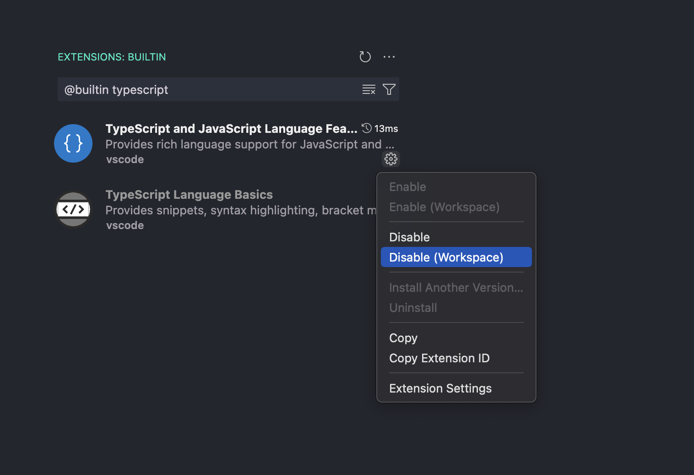

 

  

  <h3 align="center">Nuxt Extension Pack</h3>

  

    A collection of extensions for working with Nuxt/Vue 3 frameworks in VS Code.
  

  

        
        
    

  

    <a target="_blank" href="https://github.com/nuxtrdev/nuxt-vscode-extentions/discussions/new?category=extension-suggestions">
      <strong>Suggest Extensions</strong> »
    </a>
  

 

## Included Extensions

Please, refer to each extension's documentation for more information and proper configuration.

#### Official Extensions
- [Volar](https://marketplace.visualstudio.com/items?itemName=vue.volar)
- [MDC - Markdown Components](https://marketplace.visualstudio.com/items?itemName=Nuxt.mdc)

#### Community Extensions
- [Nuxtr](https://marketplace.visualstudio.com/items?itemName=Nuxtr.nuxtr-vscode)
- [Goto definition alias](https://marketplace.visualstudio.com/items?itemName=antfu.goto-alias)
 

## TypeScript Vue Plugin (Volar)

Previously Volar team introduced [TypeScript Vue Plugin (Volar)](https://marketplace.visualstudio.com/items?itemName=vue.vscode-typescript-vue-plugin), A TS server plugin to make TS server know `*.vue` files. This plugin was crucial for ensuring that TypeScript could recognize and work with Vue Single File Components (SFCs) seamlessly. It acted as a bridge between the TypeScript server and Vue files, allowing for proper handling of imports and TypeScript features within Vue SFCs.

However, with the introduction of Volar Takeover Mode, there is a shift in approach. Instead of relying on a separate TypeScript language service instance for Vue files, Volar now consolidates the support for both Vue and TypeScript under a single TypeScript language service instance. This consolidation eliminates the need for a dedicated TypeScript Vue Plugin, simplifying the setup and improving overall performance.

Both of Volar/Nuxt team recommends activating [Volar Takeover Mode](https://vuejs.org/guide/typescript/overview.html#volar-takeover-mode) over using TypeScript Vue Plugin.To activate Takeover Mode, follow these steps:

- Launch VSCode command palette with Ctrl + Shift + P (macOS: Cmd + Shift + P).
- Search for `Extensions: Show Built-in Extensions` command.
- Extensions sidebar view will get activated with `@builtin` in search bar. Do not remove it, type `typescript` after it.
- **TypeScript and JavaScript Language Features** should show up as one of the search result. Click on the gear box and choose **Disable (Workspace)**.
- Reload the workspace. Takeover mode should will work properly.

More on Takeover Mode and steps [here (Vue.js Official Documentation)](https://vuejs.org/guide/typescript/overview.html#volar-takeover-mode).

 
 

Happy Nuxting! 🚀