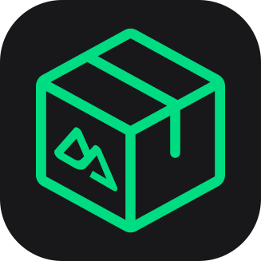

 

  

  <h3 align="center">Nuxt Extension Pack</h3>

  

    A collection of extensions for working with Nuxt/Vue 3 Framework in VS Code.
  

  

    <a target="_blank" href="https://github.com/nuxtrdev/nuxt-vscode-extentions/discussions/new?category=extension-suggestions">
      <strong>Suggest Extensions</strong> »
    </a>
  

 

## Included Extensions

Please, refer to each extension's documentation for more information and proper configuration.

#### Official Extensions
- [Volar](https://marketplace.visualstudio.com/items?itemName=vue.volar)
- [TypeScript Vue Plugin (Volar)](https://marketplace.visualstudio.com/items?itemName=vue.vscode-typescript-vue-plugin)
- [MDC - Markdown Components](https://marketplace.visualstudio.com/items?itemName=Nuxt.mdc)

#### Community Extensions
- [Nuxtr](https://marketplace.visualstudio.com/items?itemName=Nuxtr.nuxtr-vscode)
- [Goto definition alias](https://marketplace.visualstudio.com/items?itemName=antfu.goto-alias)

 
 

Happy Nuxting! 🚀